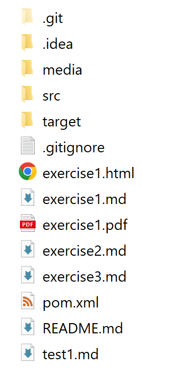
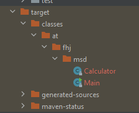
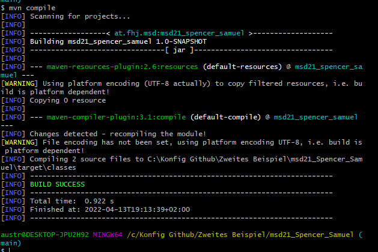

# Konfig project 03
<br>

First step was to install Maven.
Then i created a new maven project.
Local storage location is project 02.
<br>
The project is saved in the package "at.fhj.ms".
After running the project the folder "target" was created.

<br>


<br><br>

The following folder where inside.

```classes/at/fhj/msd```
<br>
```generated-sources/annotations```
<br><br>

## Console


With the command:
<br>

```-cp . at.fhj.msd.Main```
<br>
The result of the calculations will be displayd:


<br><br><br><br>
With the command:

```mvn compile```
<br><br>


