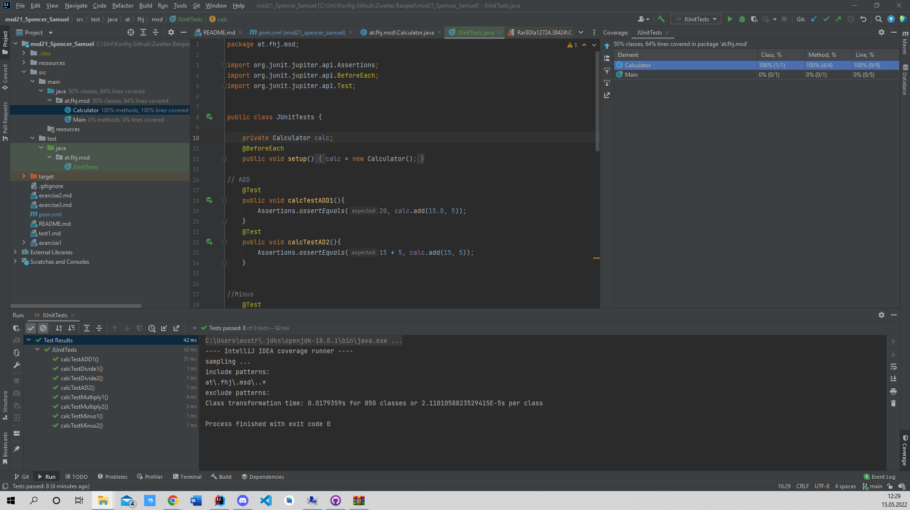

# Testcases

In total I wrote 8 test cases. Each test case was tested in two different ways.

Once where we compare the result with the result we expect. And once where we compare whether the calculation way ("Rechenweg") is the right one.

The test cases were completed with 100%

Now a short summary of the individual test cases.
   

## Add
First, I wrote two test cases where I check whether two numbers are added correctly. For this I chose the numbers 15.0 as well as 5.   

## Minus
After that I wrote another two test cases for the subtraction of two numbers. This time with 40 and 5.  

## Multiply
For the multiplication of two numbers, I chose the numbers 3 and 5, with the result of 15.  

## To devide
And lastly, I wrote a test case for the division of two numbers. 6 divided by 2 with the result of 3.  

here the following Screenshot.

  
There is also a screenrecording in the ressources/images folder (msd21_Spencer_Samuel – JUnitTests.java 2022-05-15 12-25-33.mp4)
